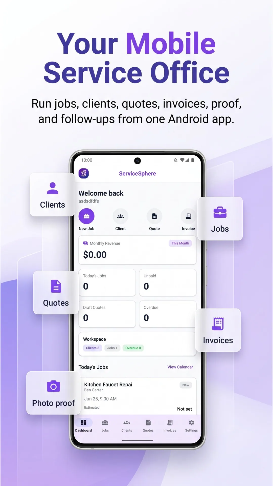
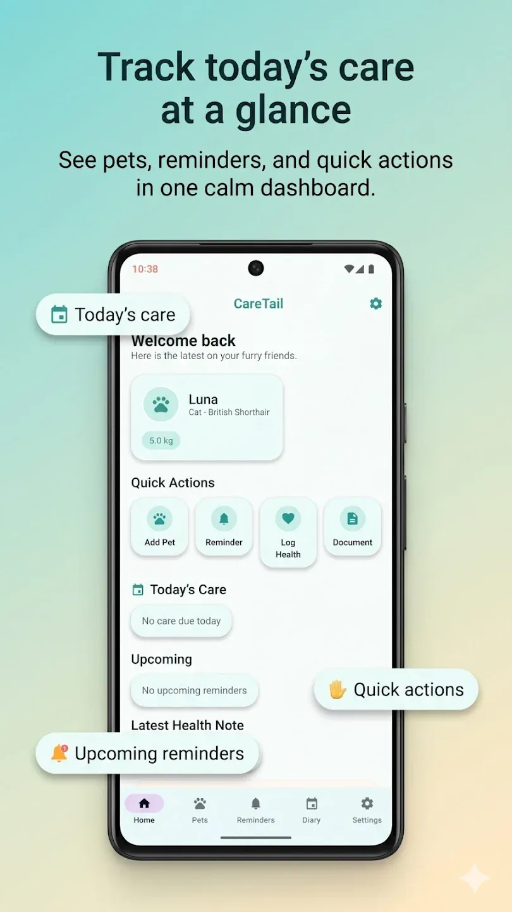
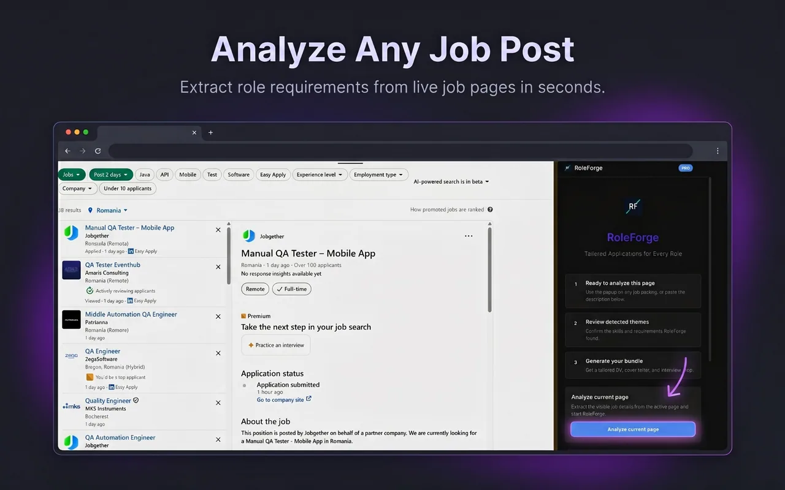

# DCP Labs Website

The public product website for DCP Labs: a focused software studio presenting practical apps, their use cases, and supporting guides in one place.

[Visit the live website](https://www.dcplabs.app/)

## Overview

DCP Labs is a single-page product website for people evaluating one of the studio's apps or arriving through a use-case search. It gives visitors a clear route from a product overview or guide to the corresponding official product destination.

The site currently presents six products across family care coordination, field service, learning, pet care, coin collecting, and job-application preparation. It is a studio website, not the source code for those individual products.

## Who it is for

- People looking for a practical tool for a specific workflow, such as organizing field-service jobs or preparing application materials.
- Existing or prospective product users who need a concise explanation of the product and a route to its official destination.
- Search visitors reading a focused guide before deciding whether a product is relevant.

## Screenshots

These are real product assets used by the website; no screenshots have been fabricated for this repository.

<p align="center">
  
  
  
</p>

The repository does not yet have a `docs/screenshots/` directory. The screenshots above intentionally reference the existing, relevant source assets rather than duplicating them.

## Key features

- Studio home, app catalogue, product-detail pages, contact, privacy, and terms routes.
- Six product profiles with feature lists, audience context, screenshots, and direct official destinations.
- Search-oriented articles authored as Markdown with validated frontmatter, category filtering, related-product calls to action, and article pages.
- Product-specific educational and support pages, including interactive tools where implemented.
- Client-side metadata and structured-data helpers for discoverability.
- Responsive navigation, motion enhancements, and Vercel Analytics loaded separately from the primary route bundle.

## Technology stack

- React 19 and TypeScript 6
- Vite 8 and the React plugin
- Tailwind CSS 4
- React Router 7 for client-side routing
- Framer Motion for interface animation
- Lucide React for icons
- Vercel Analytics and Vercel static hosting
- ESLint for static analysis

## Architecture

This is a Vite-built React single-page application. `src/main.tsx` starts the application and wraps it in `BrowserRouter`; `src/App.tsx` provides the shared shell and lazy-loads the route module and analytics. `src/PageRoutes.tsx` contains page compositions, metadata, and product-specific route content.

Product records and outbound destinations live in `src/data/apps.ts` and `src/data/appLinks.ts`. Blog posts are Markdown files in `src/content/blog/`; `src/data/blogPosts.ts` loads them at build time with `import.meta.glob`, validates required frontmatter, and creates the article index. Product screenshots and icons are local static assets under `src/assets/`. Vercel rewrites unknown paths to `index.html` so client-side routes work on direct visits.

## Main flow

1. A visitor arrives on the studio home page, a product page, or a search-focused article.
2. They browse the catalogue or use category filters to find the relevant product.
3. The product page explains the use case, boundaries, and visible capabilities using local screenshots.
4. A clear external link takes the visitor to the product's official web, Google Play, or Chrome Web Store destination.

## Product status

The website is deployed publicly at [www.dcplabs.app](https://www.dcplabs.app/). The repository implements the public studio site and its content system; it does not contain the source for the six linked products. External store availability should be treated as a live external dependency and rechecked before making a release announcement.

## My role

I owned this project end to end: product positioning, information architecture, React and TypeScript implementation, visual system, responsive interaction design, product-content integration, SEO-oriented content structure, analytics integration, deployment configuration, and release review.

AI-assisted tools were used as part of development. Product decisions, architecture, implementation review, testing, integration, and release ownership remained mine.

## Local setup

Prerequisite: a current Node.js LTS release with npm.

```bash
npm ci
npm run dev
```

Vite prints the local address after starting. To create a production build locally:

```bash
npm run build
npm run preview
```

The repository does not require a checked-in environment file for its current build. If local hosting or analytics settings are added later, keep them in ignored `.env` files and document only non-sensitive variable names in an `.env.example` file.

## Verification and testing

The available automated checks are:

```bash
npm run lint
npm run build
git diff --check
```

There are currently no committed unit, integration, or end-to-end test files, and no CI workflow in this repository. Playwright is listed as a development dependency but no runnable Playwright configuration or test suite is currently present. Manual browser checks remain appropriate for navigation, direct-route refreshes, external links, responsive layouts, and visual regression-sensitive pages.

## Known limitations

- The main route module is deliberately content-rich but large; splitting product-specific page sections into smaller modules would make future maintenance easier.
- Blog frontmatter is checked during the application build, but the content workflow has no standalone schema test suite.
- Automated browser coverage and continuous integration have not yet been added.
- Product availability, store metadata, and external destinations are outside this repository and can change independently.

## Privacy and security

The website is a static client-side application. Vercel Analytics is included in the application shell. No environment files, credential-like filenames, signing files, or high-confidence credential patterns were found in the currently tracked files during the public-repository audit.

Do not commit `.env` files, Vercel local metadata, service-account files, private keys, exports, or user data. If a credential is ever committed, revoke or rotate it immediately and remove it from Git history using a reviewed remediation process.

## License and repository status

This repository currently has no license file. Until a license is added, reuse rights are not explicitly granted. The codebase is suitable to remain public as a portfolio repository after the verification checks pass, with the limitations above clearly represented.
